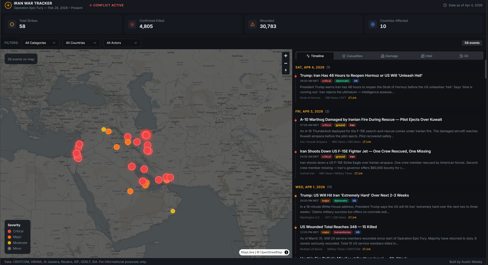
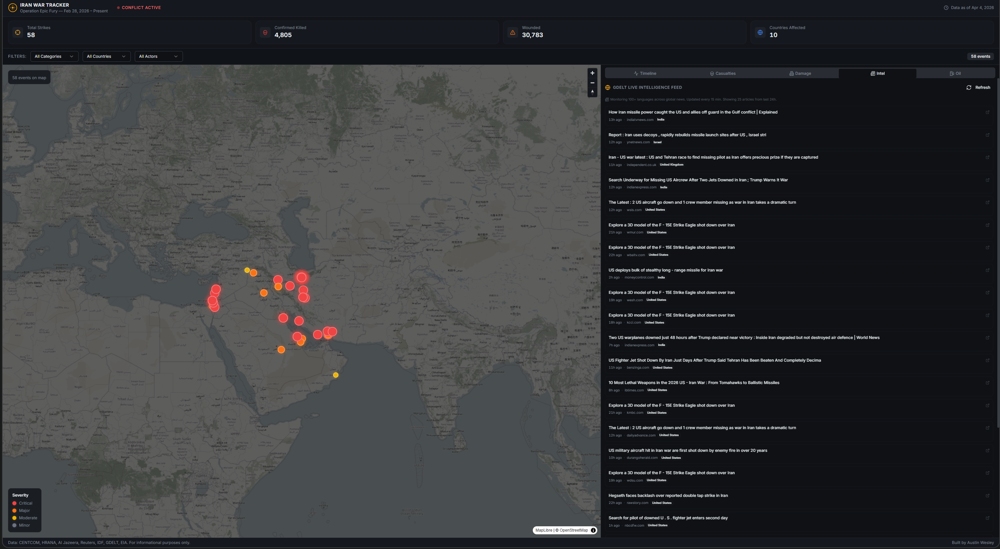
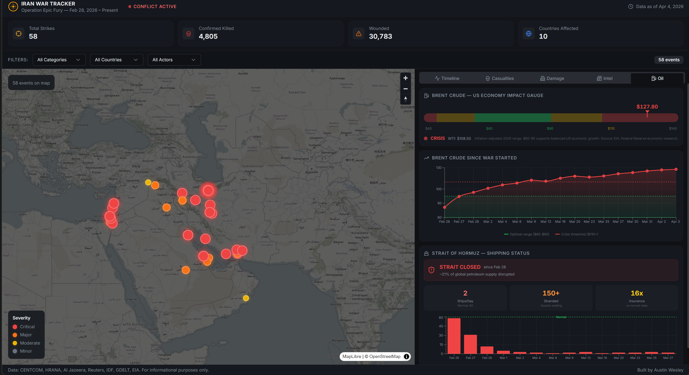
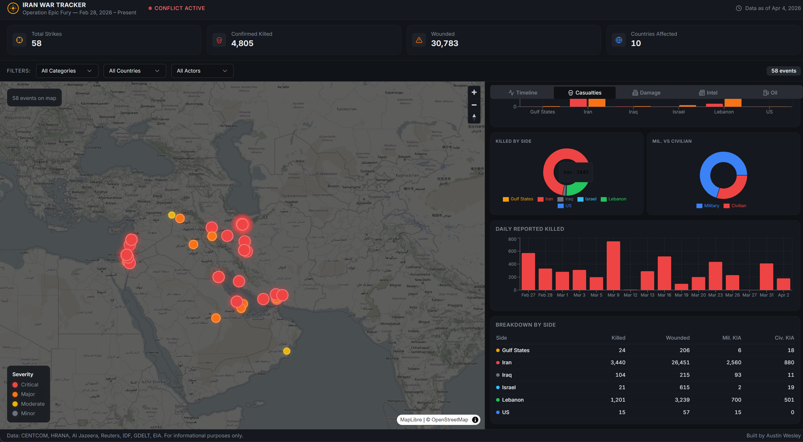
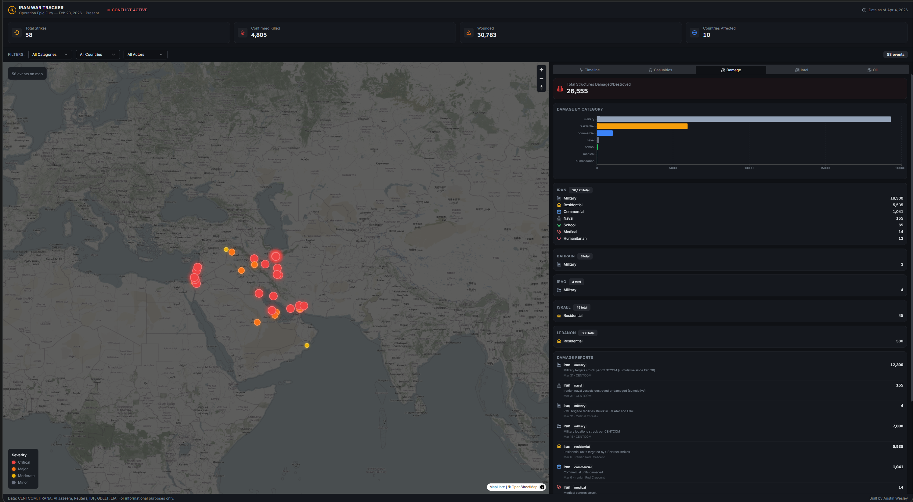

# Iran War Tracker — Operation Epic Fury COP

> A real-time conflict intelligence platform with live geospatial maps, GDELT-powered news ingestion, and economic-impact analytics for the 2026 Iran conflict (Operation Epic Fury). Built as a portfolio project demonstrating the full path from source code to a hardened, container-deployed production service — and as the data-collection / labeling layer for an upcoming ML + RAG pipeline trained on real-world OSINT.


**Stack:** React 18 / TypeScript / Express 5 / SQLite (WAL) / Drizzle ORM / MapLibre GL / Recharts / GDELT API / Docker / GitHub Actions / Trivy / Railway

---

## Live Demo

**Live URL:** https://iran-war-tracker.up.railway.app/

A live deployment runs on Railway from the `main` branch. CI must pass (typecheck + build + Trivy HIGH/CRITICAL scan) before any deploy is permitted.

---

## Screenshots

### Dashboard Overview — Interactive Map + Event Timeline
Severity-coded markers on a dark COP-style MapLibre map. Click any marker for event details, source attribution, and external links. Filter by category, country, or actor.



### GDELT Live Intelligence Feed
Real-time articles from the [GDELT Project](https://www.gdeltproject.org/) v2 Doc API, monitoring news in 100+ languages. Server-side cache (15-min TTL) respects GDELT's 1-request-per-5-seconds rate limit while serving multiple concurrent users.



### Oil Price Gauge + Strait of Hormuz Shipping Monitor
Brent crude price plotted against the US economy's inflation-adjusted "Goldilocks zone" ($60-$90/bbl). Green = optimal, yellow = strain, red = crisis. The Hormuz panel tracks daily transit counts, stranded vessels, and the war-risk insurance multiplier (~16× pre-war).



### Casualty Analytics
Breakdowns by side, military vs civilian, and daily trends. Bar and donut charts with a detail table showing killed, wounded, military KIA, and civilian KIA per side.



### Infrastructure Damage
Categorized damage reports (residential, military, medical, school, commercial, humanitarian) with country-level rollups and individual incident tracking.



---

## What This Project Demonstrates

This is a portfolio piece, so the README is intentionally explicit about the engineering choices. The project demonstrates:

1. **Full-stack TypeScript** — typed end-to-end from Drizzle schema → Express handlers → React Query → UI components. A single `shared/schema.ts` is the source of truth for both the DB and runtime Zod validation.
2. **Real third-party integration** — a live GDELT Doc API proxy with bounded server-side caching, defensive fallback to stale cache on upstream error, and rate-limit-aware design.
3. **Production containerization** — multi-stage Dockerfile, non-root runtime user, native-module support (`better-sqlite3`), `dumb-init` PID-1, and a `gosu`-based entrypoint that handles the Railway-mounted-volume ownership problem.
4. **Hardened CI/CD pipeline** — GitHub Actions runs typecheck → build → Docker build → Trivy HIGH/CRITICAL scan → SARIF upload to the GitHub Security tab. Deployment to Railway is gated on CI success via `workflow_run`.
5. **VEX-style vulnerability triage** — every Trivy finding that is suppressed is documented in [`.trivyignore`](.trivyignore) with explicit exploitability reasoning (attack-surface analysis, remediation path, review cadence). No silent suppressions.
6. **Data layer designed for ML** — events, casualties, and infrastructure tables are structured for downstream embedding, classification, and RAG retrieval. The dashboard is the labeling UI; the API is the inference-time serving layer.

---

## Architecture

```
┌─────────────────────────────────────────────────────────────┐
│                     Client (React 18 + Vite)                 │
│  ┌──────────┐  ┌──────────┐  ┌────────────────────────────┐ │
│  │ Dashboard │  │ MapLibre │  │ Recharts                    │ │
│  │  5 Tabs   │──│  GL Map  │  │ Casualty / Oil / Hormuz     │ │
│  └──────────┘  └──────────┘  └────────────────────────────┘ │
│                       │                                      │
│              TanStack React Query                            │
│              Stats / Events:  5-min poll                     │
│              GDELT articles: 15-min poll                     │
│                       ▼                                      │
│                fetch("/api/...")                              │
└───────────────────────┬──────────────────────────────────────┘
                        │ HTTP
┌───────────────────────┴──────────────────────────────────────┐
│                  Server (Express 5 + TypeScript)              │
│                                                               │
│  Local data                       External data               │
│  ┌──────────────────────┐         ┌────────────────────────┐ │
│  │ /api/stats            │         │ /api/gdelt/articles    │ │
│  │ /api/events           │         │ /api/gdelt/tone        │ │
│  │ /api/casualties[/sum] │         │   ↳ 15-min in-memory   │ │
│  │ /api/infrastructure   │         │     cache, stale-while │ │
│  │ /api/oil-price        │         │     -error fallback    │ │
│  │ /api/hormuz           │         │ /api/oil-price (static)│ │
│  └──────┬───────────────┘         │ /api/hormuz    (static)│ │
│         │ Drizzle ORM              └────────────────────────┘ │
│         ▼                                                     │
│  SQLite (better-sqlite3, WAL mode)                            │
│  Path: $DB_PATH (defaults to /data/data.db on Railway,        │
│                  ./data.db locally)                            │
│  ┌──────────────────────────────────────┐                    │
│  │ events           (57+ labeled)        │                    │
│  │ casualties       (daily snapshots)    │                    │
│  │ infrastructure   (damage by category) │                    │
│  └──────────────────────────────────────┘                    │
└───────────────────────────────────────────────────────────────┘

┌──────────────────────────── Container ────────────────────────────┐
│ Stage 1 (builder): node:20-bookworm-slim + python3/make/g++       │
│   → npm ci --include=dev → vite build + esbuild bundle            │
│   → npm prune --omit=dev                                          │
│ Stage 2 (runner):  node:20-bookworm-slim + dumb-init + gosu       │
│   → npm/npx/corepack stripped (~11 HIGH CVEs eliminated)          │
│   → non-root user `nodejs` (uid 1001)                             │
│   → ENTRYPOINT: dumb-init → docker-entrypoint.sh → node app       │
│   → entrypoint chowns /data, then `gosu` drops to nodejs          │
│   → idempotent `drizzle-kit push` on every boot                   │
│   → optional `SEED_ON_BOOT=true` for fresh environments           │
└────────────────────────────────────────────────────────────────────┘

┌──────────────────────────── CI / CD ─────────────────────────────┐
│ ci.yml (every push + PR):                                          │
│   typecheck-and-build → docker-build-scan → Trivy HIGH/CRITICAL   │
│   → SARIF upload to GitHub Security tab                            │
│ deploy.yml (workflow_run, gated on CI success on main):           │
│   railway up --service iran-war-tracker --ci                       │
└────────────────────────────────────────────────────────────────────┘
```

---

## Tech Stack

| Layer | Technology | Purpose |
|---|---|---|
| **Frontend** | React 18, TypeScript, Vite | UI framework with HMR dev server |
| **Styling** | Tailwind CSS v3, shadcn/ui, Radix primitives | Dark COP theme + accessible components |
| **Maps** | MapLibre GL JS | Interactive vector map with custom severity markers |
| **Charts** | Recharts | Bar / pie / area / line analytics |
| **Client state** | TanStack React Query | Server state, polling, cache invalidation |
| **Backend** | Express 5, TypeScript (esbuild bundle) | REST API + GDELT proxy with caching |
| **Database** | SQLite via `better-sqlite3` (WAL mode), Drizzle ORM, Zod | Type-safe relational DB + runtime validation |
| **Schema migrations** | `drizzle-kit push` (idempotent on boot) | Schema applied at container startup |
| **Live data source** | GDELT v2 Doc API | Global event monitoring (100+ languages) |
| **Container runtime** | Docker (multi-stage, Debian slim) | Glibc base for `better-sqlite3` native module |
| **PID 1 / signals** | `dumb-init` | Lightweight signal forwarder (replaced `tini` for CVE reduction — see notes below) |
| **Privilege drop** | `gosu` | Root → `nodejs` user inside entrypoint after chown |
| **CI** | GitHub Actions | Typecheck, build, Docker build, Trivy scan, SARIF upload |
| **Vulnerability scanning** | Trivy (OS + library, HIGH/CRITICAL, fail on findings) | Image scan with documented `.trivyignore` |
| **Hosting** | Railway (Dockerfile build, mounted volume at `/data`) | Persistent SQLite across redeploys |

---

## Recent Engineering Work (Highlights)

These are the changes that turned the project from "runs on my laptop" into "runs in production with real CI/CD." They're called out here because they're the most resume-relevant pieces of the repo.

### Hardened Dockerfile
- **Multi-stage build** — `node:20-bookworm-slim` builder with full toolchain (`python3 make g++`) for `better-sqlite3`'s native compile, then a minimal runtime stage.
- **Non-root runtime** — explicit `nodejs:nodejs` (uid 1001) user; `WORKDIR /app` chowned at build.
- **Stripped npm/npx/corepack from the runtime image** — the app runs `node dist/index.cjs` directly, so the npm CLI is dead weight. Removing it eliminated **~11 HIGH CVEs** in one shot (npm bundles vulnerable versions of `tar`, `minimatch`, `glob`, `cross-spawn`, `lodash`).
- **Swapped `tini` → `dumb-init`** — `tini` ships with a Go-stdlib that flagged 8 CVEs in Trivy; none reachable from a signal-forwarder, but `dumb-init` is pure C and removes the noise entirely.
- **Healthcheck** — uses Node's built-in `http` (no `curl`/`wget` needed in the image) hitting `/api/stats`.

### Railway-aware entrypoint
Railway mounts persistent volumes owned by `root` regardless of what the image does at build time. The entrypoint script handles this cleanly:

```sh
# Detect we're root → fix /data ownership → re-exec as nodejs via gosu
if [ "$(id -u)" = "0" ]; then
  mkdir -p "$DB_DIR"
  chown -R nodejs:nodejs "$DB_DIR"
  exec gosu nodejs:nodejs "$0" "$@"
fi
```

Then it runs `drizzle-kit push --force` (idempotent), optionally seeds via `SEED_ON_BOOT=true`, and execs the Node process. Both `drizzle-kit` and `tsx` are invoked through their `node_modules` bin entrypoints because the npm CLI was stripped from the runtime image.

### CI: typecheck → build → Docker → Trivy
[`.github/workflows/ci.yml`](.github/workflows/ci.yml) runs on every push and PR:
1. `tsc` typecheck
2. `vite build` + esbuild server bundle
3. Docker `buildx` build with GHA cache
4. Trivy scan, **`exit-code: 1` on any HIGH/CRITICAL** with `.trivyignore` applied and unfixed CVEs ignored
5. SARIF report uploaded to the GitHub Security tab for ongoing tracking

### Deploy: gated on CI success
[`.github/workflows/deploy.yml`](.github/workflows/deploy.yml) uses `workflow_run` so deploys only fire after CI passes on `main`. A single concurrency group (`deploy-production`, `cancel-in-progress: false`) prevents overlapping deploys.

### `.trivyignore` as VEX
Every suppressed CVE in [`.trivyignore`](.trivyignore) carries an inline justification covering: which dependency surface flagged it, why it's not exploitable in this runtime (attack-surface analysis), the remediation path that would let us drop the suppression, and a review cadence. No silent ignores.

### Schema/data fixes worth noting
- `path-to-regexp` HIGH CVE patched via `npm audit fix`.
- Bumped 13 HIGH CVEs flagged by an early Trivy run.
- Fixed a MapLibre marker hover bug caused by a CSS `transform` conflicting with MapLibre's marker positioning.
- Added `cross-env` and a Node v24 `reusePort` fix for Windows compatibility.

---

## API Endpoints

| Method | Endpoint | Description | Example |
|---|---|---|---|
| `GET` | `/api/stats` | Dashboard KPIs | — |
| `GET` | `/api/events` | Events with optional filters | `?category=airstrike&country=Iran&actor=US` |
| `GET` | `/api/events/:id` | Single event by ID | `/api/events/42` |
| `GET` | `/api/casualties` | Casualty records | `?side=Iran&country=Iran` |
| `GET` | `/api/casualties/summary` | Aggregated by side | — |
| `GET` | `/api/infrastructure` | Damage records | `?country=Iran&category=military` |
| `GET` | `/api/infrastructure/summary` | Aggregated by category × country | — |
| `GET` | `/api/gdelt/articles` | Live GDELT articles (15-min cache, stale-on-error) | — |
| `GET` | `/api/gdelt/tone` | GDELT 7-day sentiment timeline | — |
| `GET` | `/api/oil-price` | Brent crude + acceptable-range overlay | — |
| `GET` | `/api/hormuz` | Strait of Hormuz shipping status | — |

---

## Data Model

```ts
events           { id, date, title, description, category, actor, target,
                   lat, lng, location, country, source, sourceUrl, severity }
casualties       { id, date, country, side, killed, wounded,
                   militaryKilled, civilianKilled, source }
infrastructure   { id, date, country, category, count, description, source }
```

Schema lives in [`shared/schema.ts`](shared/schema.ts) and is consumed by Drizzle (DB) and `drizzle-zod` (runtime validation) so the same type definition flows through the entire stack.

---

## Getting Started

### Prerequisites
- Node.js v18+ (v20 recommended — matches the container)
- npm
- (Optional) Docker if you want to run the production container locally

### Local development

```bash
git clone https://github.com/Nominal-Ninja/iran-war-tracker.git
cd iran-war-tracker

npm install
npx drizzle-kit push      # creates ./data.db
npm run dev               # http://localhost:3000 — seeds on first run
```

### Run the production container locally

```bash
docker build -t iran-war-tracker:local .

docker run --rm -p 3000:3000 \
  -v "$(pwd)/data:/data" \
  -e SEED_ON_BOOT=true \
  iran-war-tracker:local
```

### Reset local data

```bash
rm data.db                # or: del data.db on Windows
npx drizzle-kit push
npm run dev
```

---

## Deployment (Railway)

1. **Create a Railway project** — point it at this repo. Railway auto-detects the `Dockerfile`.
2. **Attach a persistent Volume** — mount it at `/data` (matches `DB_PATH=/data/data.db` set in the Dockerfile).
3. **Set `RAILWAY_TOKEN`** in your GitHub repo's Actions secrets so [`deploy.yml`](.github/workflows/deploy.yml) can `railway up`.
4. **(Optional) `SEED_ON_BOOT=true`** as a Railway env var for fresh environments. Leave unset on production after the first boot — the seed is idempotent but unnecessary.

### Switching to Fly.io
The Dockerfile is host-agnostic (intentionally no `VOLUME` keyword, since Railway requires volumes via UI). For Fly.io, swap the deploy step in [`deploy.yml`](.github/workflows/deploy.yml) to:

```yaml
- uses: superfly/flyctl-actions/setup-flyctl@master
- run: flyctl deploy --remote-only
  env:
    FLY_API_TOKEN: ${{ secrets.FLY_API_TOKEN }}
```

…and declare a `[mounts]` block in `fly.toml` pointing to `/data`.

---

## Project Structure

```
iran-war-tracker/
├── .github/workflows/
│   ├── ci.yml                  # typecheck + build + Docker + Trivy + SARIF
│   └── deploy.yml              # Railway deploy gated on CI success
├── client/                     # React 18 + Vite frontend
│   └── src/
│       ├── components/
│       │   ├── conflict-map.tsx        # MapLibre GL interactive map
│       │   ├── event-timeline.tsx      # Chronological event feed
│       │   ├── casualty-chart.tsx      # Casualty analytics + charts
│       │   ├── infrastructure-panel.tsx # Damage tracking panel
│       │   ├── gdelt-feed.tsx          # Live GDELT intelligence feed
│       │   └── economic-impact.tsx     # Oil gauge + Hormuz shipping
│       ├── pages/dashboard.tsx
│       └── index.css                   # Tailwind + dark COP theme
├── server/
│   ├── index.ts                # Express bootstrap + request logging
│   ├── routes.ts               # API + GDELT proxy with 15-min cache
│   ├── storage.ts              # Drizzle queries (DB_PATH-aware)
│   ├── seed.ts                 # Idempotent conflict-data seeding
│   ├── static.ts               # Production static-asset serving
│   └── vite.ts                 # Dev-mode Vite middleware
├── shared/schema.ts            # Single source of truth: Drizzle + Zod
├── script/build.ts             # Vite client + esbuild server bundle
├── screenshots/                # README assets
├── Dockerfile                  # Multi-stage, hardened, non-root
├── docker-entrypoint.sh        # gosu-based volume-perms fix + drizzle push
├── .trivyignore                # VEX-style suppressions, fully justified
├── drizzle.config.ts
├── package.json
└── README.md
```

---

## Data Sources

All seed data is sourced from publicly available OSINT reporting:

| Source | Type | Use |
|---|---|---|
| **CENTCOM** | Official statements | US strike counts, operational updates |
| **HRANA** | Human rights NGO | Civilian casualty documentation |
| **Hengaw Organization** | Kurdish human rights | Military casualty estimates |
| **Critical Threats (AEI/ISW)** | Think tank | Daily military analysis |
| **Al Jazeera, Reuters, Military Times** | News / wire | Verified breaking events |
| **IDF** | Official statements | Israeli military operations |
| **GDELT Project** | Academic / API | Live global news monitoring |

---

## Roadmap

### Phase 1 — Dashboard, ingestion, container, CI/CD (Complete)
- [x] Interactive conflict map (MapLibre GL, severity-coded markers)
- [x] Event timeline with filtering by category / country / actor
- [x] Casualty analytics + infrastructure-damage tracking
- [x] GDELT live feed with server-side cache + stale-on-error fallback
- [x] Oil price gauge with US-economy "acceptable range" overlay
- [x] Strait of Hormuz shipping monitor
- [x] Multi-stage hardened Dockerfile (non-root, dumb-init, gosu, stripped npm)
- [x] GitHub Actions CI: typecheck + build + Trivy HIGH/CRITICAL + SARIF
- [x] Railway deploy via `workflow_run`, gated on CI success
- [x] VEX-style `.trivyignore` with documented exploitability analysis
- [x] Persistent SQLite via Railway volume + entrypoint chown handling

### Phase 2 — ML classifier (In Progress)
- [ ] Python event classifier (scikit-learn baseline → PyTorch fine-tune)
- [ ] Auto-classify GDELT headlines by event type / severity / actor
- [ ] `/api/classify` prediction endpoint (sidecar service)
- [ ] Model evaluation: confusion matrix, precision/recall by class

### Phase 3 — RAG system
- [ ] Vector database (ChromaDB or pgvector) for event/article embeddings
- [ ] LangChain RAG pipeline with citation-backed answers
- [ ] "Ask about the conflict" UI with retrieved-passage display
- [ ] Agent-style multi-step queries (LangGraph)

### Phase 4 — Operational polish
- [ ] Live oil-price API (EIA) replacing the static `/api/oil-price` payload
- [ ] AIS/MarineTraffic integration replacing static Hormuz data
- [ ] Backups + restore for the Railway SQLite volume
- [ ] Public Grafana dashboard fronting the API

---

## Contributing

PRs welcome. The most useful areas right now:
- **GDELT query coverage** — additional queries to broaden article ingestion
- **Phase 2 classifier** — feature engineering, label-set design, eval harness
- **Live data integrations** — EIA oil prices, AIS/MarineTraffic shipping
- **Tests** — there are none yet; an integration test for the GDELT proxy + a snapshot test for `/api/stats` would land cleanly

Open an issue first for major changes.

---

## Author

**Austin Wesley** — Data engineer transitioning to AI/ML engineering.
- GitHub: [@Nominal-Ninja](https://github.com/Nominal-Ninja)
- This project is part of an 18-month AI Engineer development portfolio focused on shipping AI systems, not just training notebooks.

---

## License

[MIT](LICENSE)

---

## Disclaimer

This application is for informational and educational purposes only. Casualty and event data is sourced from publicly available reports and may not reflect the complete picture. Data accuracy depends on the cited reporting organizations.
